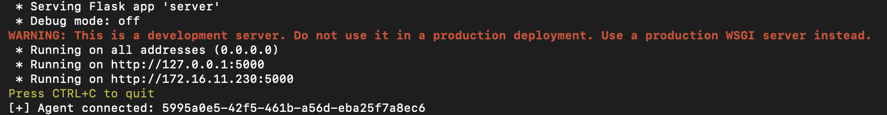
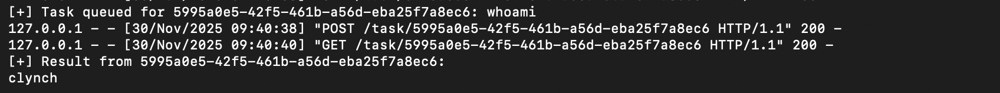

# PyC2
A minimal Command‑and‑Control (C2) framework built for learning. It uses a lightweight Flask server and a small agent script that polls for tasks, runs them, and sends results back. Easy to read and extend.

This project demonstrates the core concepts of C2 communication: agent registration, tasking, polling, and result exfiltration using simple HTTP endpoints.





## Features
- Agent registration  
- Server‑side task queue  
- Agent polling loop  
- Executes remote system commands  
- Result posting to server  
- Python-based
- Works on Linux, macOS, Windows  

## Requirements

```
pip install flask
```
```
pip install requests
```

## Running the C2

### 1. Start the Server
```
python3 server.py
```

### 2. Start the Agent
```
python3 client.py
```

The agent will register and print an agent ID.

## Sending Commands to Agents

Open another terminal to curl remote commands (see below)

### Linux
```
curl -H "Content-Type: text/plain" --data-binary "{command}" http://127.0.0.1:5000/task/<agent_id>
```

### macOS
```
curl -H "Content-Type: text/plain" --data-binary "{command}" http://127.0.0.1:5000/task/<agent_id>
```

### Windows (PowerShell)
```
Invoke-WebRequest -Uri "http://127.0.0.1:5000/task/<agent_id>" -Method POST -Body "{command}" -ContentType "text/plain"
```

## Command Response
Command responses appear in the server terminal.

## Usage
Use only with permission. For research and education.
